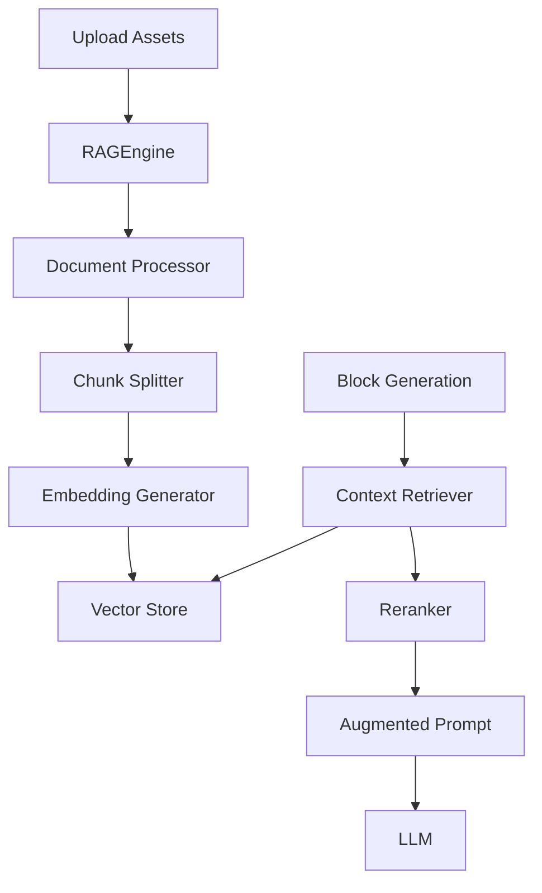

# Phase 2: RAG & Quality Engine - Detailed Planning

**Planning Date:** 2025-11-24  
**Architect:** System Design Lead  
**Status:** Ready for Implementation  
**Estimated Effort:** 2-3 days

---

## Objective

Implement a RAG (Retrieval-Augmented Generation) engine to improve letter quality by incorporating context from user-uploaded assets (estrategia.pdf, onenote.pdf, other documents) into the generation process.

---

## Current State Analysis

### What We Have
- ✅ Users can upload `attached_assets/*.pdf` documents
- ✅ Documents are stored in `storage/uploads/{submission_id}/`
- ✅ Basic PDF extraction via `pdfplumber` in `pdf_extractor.py`

### What's Missing
- ❌ No vector embeddings or semantic search
- ❌ Assets are not ingested or indexed
- ❌ Context is not passed to LLM during generation
- ❌ No relevance scoring or filtering

---

## Architecture Design

### System Components



### Data Flow

1. **Ingestion Phase** (During submission processing)
   - Extract text from PDFs
   - Split into semantic chunks (500-800 tokens)
   - Generate embeddings using OpenAI `text-embedding-3-small`
   - Store in lightweight vector DB (in-memory or SQLite)

2. **Retrieval Phase** (During letter generation)
   - Generate query embedding from block context
   - Search for top-k relevant chunks (k=5-10)
   - Rerank by relevance and diversity
   - Inject top 3-5 chunks into generation prompt

---

## Implementation Plan

### File Structure
```
backend/app/
├── core/
│   ├── rag_engine.py          # NEW - Main RAG orchestrator
│   ├── document_chunker.py    # NEW - Smart text splitting
│   ├── embedding_service.py   # NEW - OpenAI embeddings
│   └── vector_store.py        # NEW - Simple vector DB
```

### 1. RAG Engine Core (`core/rag_engine.py`)

**Responsibilities:**
- Coordinate ingestion and retrieval
- Manage vector store lifecycle
- Provide clean API for block generators

**Interface:**
```python
class RAGEngine:
    def __init__(self, llm_processor):
        self.llm = llm_processor
        self.embedder = EmbeddingService(llm.client)
        self.vector_store = VectorStore()
        self.chunker = DocumentChunker()
    
    def ingest_assets(self, submission_id: str, asset_paths: List[str]):
        """Process and index all assets for a submission"""
        pass
    
    def retrieve_context(self, query: str, submission_id: str, top_k: int = 5) -> List[str]:
        """Retrieve relevant chunks for a query"""
        pass
    
    def augment_prompt(self, base_prompt: str, context_chunks: List[str]) -> str:
        """Inject context into generation prompt"""
        pass
```

**Key Methods:**

1. **`ingest_assets()`**
   - Read PDFs from `storage/uploads/{submission_id}/`
   - Extract text using existing `PDFExtractor`
   - Split into chunks using `DocumentChunker`
   - Generate embeddings for each chunk
   - Store in `VectorStore` with metadata

2. **`retrieve_context()`**
   - Generate query embedding
   - Search vector store by cosine similarity
   - Filter by submission_id (isolation)
   - Return top-k chunks with scores

3. **`augment_prompt()`**
   - Format context chunks as markdown
   - Insert into prompt template
   - Add instructions for LLM to use context

---

### 2. Document Chunker (`core/document_chunker.py`)

**Purpose:** Split documents into semantically meaningful chunks

**Strategy:**
```python
class DocumentChunker:
    def __init__(self, chunk_size: int = 600, overlap: int = 100):
        self.chunk_size = chunk_size
        self.overlap = overlap
    
    def chunk_text(self, text: str, metadata: dict = None) -> List[Chunk]:
        """
        Smart chunking:
        1. Split by paragraphs first
        2. Combine into chunks of ~600 tokens
        3. Overlap for context preservation
        4. Maintain metadata (source file, page number)
        """
        pass
```

**Why 600 tokens?**
- Embeddings work best with focused content
- Balances specificity vs coverage
- Leaves room for prompt context (4K window)

---

### 3. Embedding Service (`core/embedding_service.py`)

**Purpose:** Generate vector embeddings using OpenAI

**Implementation:**
```python
class EmbeddingService:
    def __init__(self, openai_client):
        self.client = openai_client
        self.model = "text-embedding-3-small"  # Cost-effective
    
    def embed_text(self, text: str) -> List[float]:
        """Generate embedding vector (1536 dimensions)"""
        response = self.client.embeddings.create(
            model=self.model,
            input=text
        )
        return response.data[0].embedding
    
    def embed_batch(self, texts: List[str]) -> List[List[float]]:
        """Batch embedding for efficiency"""
        pass
```

**Cost Estimation:**
- Model: `text-embedding-3-small` ($0.02 / 1M tokens)
- Average submission: ~50 chunks = ~30K tokens
- Cost per submission: ~$0.0006 (negligible)

---

### 4. Vector Store (`core/vector_store.py`)

**Purpose:** Lightweight vector database for semantic search

**Option A: In-Memory (Recommended for MVP)**
```python
import numpy as np
from sklearn.metrics.pairwise import cosine_similarity

class VectorStore:
    def __init__(self):
        self.vectors = {}  # submission_id -> List[(vector, chunk, metadata)]
    
    def add_vectors(self, submission_id: str, chunks: List[Chunk]):
        """Store chunk vectors"""
        pass
    
    def search(self, query_vector: List[float], submission_id: str, top_k: int = 5):
        """Cosine similarity search"""
        vectors = self.vectors.get(submission_id, [])
        similarities = cosine_similarity([query_vector], [v[0] for v in vectors])
        top_indices = np.argsort(similarities[0])[-top_k:]
        return [vectors[i] for i in top_indices]
```

**Option B: SQLite with Vector Extension (Production)**
- Use `sqlite-vss` extension
- Persistent storage
- Scales better for large datasets

**Decision:** Start with Option A, migrate to Option B if needed

---

### 5. Integration with Block Generator

**Location:** `core/block_generator.py`

**Changes Required:**

```python
class BlockGenerator:
    def __init__(self, llm_processor, prompt_enhancer=None, rag_engine=None):
        self.llm = llm_processor
        self.prompt_enhancer = prompt_enhancer
        self.rag_engine = rag_engine  # NEW
    
    def generate_block3(self, testimony: Dict, design: Dict, context: Dict, ...):
        base_prompt = f"""... original prompt ..."""
        
        # NEW: RAG enhancement
        if self.rag_engine and context.get('submission_id'):
            # Build search query from testimony context
            query = f"Informações sobre {testimony['name']}, {testimony['role']}"
            
            # Retrieve relevant context
            context_chunks = self.rag_engine.retrieve_context(
                query=query,
                submission_id=context['submission_id'],
                top_k=5
            )
            
            # Augment prompt
            base_prompt = self.rag_engine.augment_prompt(base_prompt, context_chunks)
        
        # Continue with normal generation
        return self._call_llm_with_retry(base_prompt, ...)
```

**Prompt Augmentation Template:**
```python
def augment_prompt(self, base_prompt: str, context_chunks: List[str]) -> str:
    if not context_chunks:
        return base_prompt
    
    context_section = "# CONTEXTO ADICIONAL DO USUÁRIO\n\n"
    context_section += "Use as informações abaixo para enriquecer a carta com detalhes específicos:\n\n"
    
    for i, chunk in enumerate(context_chunks, 1):
        context_section += f"## Fonte {i}\n{chunk}\n\n"
    
    context_section += "Integre essas informações naturalmente na narrativa.\n\n---\n\n"
    
    return context_section + base_prompt
```

---

### 6. Processor Integration

**Location:** `core/processor.py`

**Update `process_submission()` method:**

```python
def process_submission(self, submission_id: str):
    # ... existing extraction logic ...
    
    # NEW: Ingest assets into RAG
    asset_files = []
    if os.path.exists(f"{upload_dir}/estrategia.pdf"):
        asset_files.append(f"{upload_dir}/estrategia.pdf")
    if os.path.exists(f"{upload_dir}/onenote.pdf"):
        asset_files.append(f"{upload_dir}/onenote.pdf")
    # ... add other_documents ...
    
    if asset_files:
        print(f"📚 Ingesting {len(asset_files)} assets into RAG...")
        self.rag_engine.ingest_assets(submission_id, asset_files)
    
    # ... continue with generation ...
```

---

## Testing Strategy

### Unit Tests
- `test_document_chunker.py`
  - Test chunk size consistency
  - Test overlap preservation
  - Test metadata attachment

- `test_embedding_service.py`
  - Test embedding generation
  - Test batch processing
  - Mock OpenAI API calls

- `test_vector_store.py`
  - Test vector addition
  - Test similarity search
  - Test filtering by submission_id

### Integration Tests
- `test_rag_engine.py`
  - End-to-end ingestion
  - Context retrieval accuracy
  - Prompt augmentation

### Quality Tests
- Manual review: Compare letters with/without RAG
- Metrics: Context relevance score, information density
- A/B testing: User satisfaction ratings

---

## Performance Considerations

### Latency Budget
- **Ingestion:** ~10-20s for typical submission (acceptable during background processing)
- **Retrieval:** <100ms per query (shouldn't slow down generation)

### Optimizations
1. **Batch Embeddings:** Process chunks in batches of 100
2. **Caching:** Cache submission vectors in memory
3. **Async Processing:** Ingest assets asynchronously

### Scalability
- Current: In-memory vector store (scales to ~10K submissions)
- Future: Migrate to Pinecone/Weaviate for production scale

---

## Risks & Mitigations

| Risk | Impact | Mitigation |
|------|--------|------------|
| Hallucination with RAG context | Medium | Add source citations, verify facts |
| Irrelevant context injection | Low | Improve query generation, add relevance threshold |
| Increased latency | Medium | Optimize retrieval, consider caching |
| Cost of embeddings | Low | Use `text-embedding-3-small`, batch processing |
| Context window limits | Low | Chunk size optimization, selective retrieval |

---

## Success Criteria

1. **Quality Improvement:**
   - Letters include specific details from assets
   - Reduced generic content
   - Higher user satisfaction scores (>8/10)

2. **Technical Metrics:**
   - Ingestion success rate: >95%
   - Retrieval latency: <100ms
   - Context relevance: >70% (manual review)

3. **User Feedback:**
   - Users report letters feel "more personalized"
   - Fewer regeneration requests

---

## Implementation Timeline

**Day 1: Core RAG Infrastructure**
- [x] Create `rag_engine.py` skeleton
- [ ] Implement `DocumentChunker`
- [ ] Implement `EmbeddingService`
- [ ] Implement `VectorStore` (in-memory)
- [ ] Unit tests for each component

**Day 2: Integration**
- [ ] Update `SubmissionProcessor` for ingestion
- [ ] Update `BlockGenerator` for augmentation
- [ ] Integration tests
- [ ] Manual testing with sample submission

**Day 3: Testing & Refinement**
- [ ] Quality review of generated letters
- [ ] Performance optimization
- [ ] Documentation
- [ ] Deploy to staging

---

## Next Steps

1. **Review this plan** with team
2. **Get approval** for approach
3. **Start implementation** on Day 1 tasks
4. **Iterate** based on quality feedback

---

**Prepared by:** AI System Architect  
**Status:** ✅ Ready for Implementation  
**Estimated ROI:** High (significant quality improvement for minimal cost)
